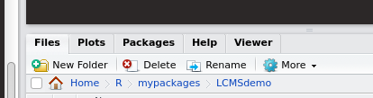
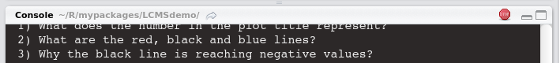
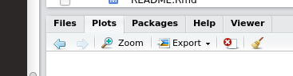

```{r global_options, include=FALSE}
knitr::opts_chunk$set(eval=FALSE)
```

Demo for the EBI metabolomics course. The package is designed to provide an interactive (and gentle) introduction to xcms. The majority of the demos is provided in form of `shiny` web applications, which rely on `plotly` to perform interactive plotting.


# Installation

* Depends on


```
xcms,CAMERA, ptw, scales, shiny, ggplot2, plotly, markdown
```

* Install devtools: in the R/R Studio shell type
```{r}
install.packages("devtools")
```

* Install LCMSdemo: In the shell type
```{r}
library(devtools)
install_github("pietrofranceschi/LCMSdemo", dependencies = TRUE) 
```

* Load the package: In shell type
```{r}
library(LCMSdemo)
```
******

# Usage

The demo covers some of the key step in the preprocessing of untargeted metabolomics data by `xcms`.
The demo is not designed to be exhaustive, but it wants to highlight some of the crucial points, focusing on the impact of some of the tunable parameters on the overall results. Even if it is clearly `xcms` oriented, many of the concepts and ideas are implemented behind the scenes of many commercial closed source software solutions. 

The step covered in the demo include:

* Visualization and inspection of the raw LC-MS data
* Peak picking
* Grouping and Retention time alignment


#### Dataset
The data used for the demo are the results of a UPLC-QTOF(-) analysis of a set of apple extracts. The raw data and the description of the samples are available @Metabolights (MTBLS59). Preprocessed data matrices are also included in the `BioMark` R package available @CRAN


*******

### Visualization of the Raw Data
Each raw file (cdf,mzXML) contains the data recorded by the mass spectrometer during the analysis of **one** sample. The data are two dimensional in nature and it is always a good idea to get a feeling on their properties looking at them. 

#### Profile Matrix 
The profile matrix gives a two dimensional global overview of the raw data. In `xcms` the profile matrix is constructed by binning the spectrometer data along the m/z dimension. The size of the bins will have a strong impact on dimension of the profile matrix, with possible consequences on the speed of the overall data preprocessing.
In the R Studio console the specific demo con be run with

```{r}
shinyExample('profmat')
```

To stop the web based demo just close the window.

#### Extracted Ion Traces
As a general rule, the ionization of each metabolite will result in several ions (fragments, isotopes, adducts) and the "chromatographic" profile of each one of them will show a peak in correspondence of the elution time of the metabolite. These ion specific chromatographic profiles are called Extracted Ion Chromatograms/Traces (EIC/EIT) and they play a pivotal role in many preprocessing algorithm. In the ideal case the show a clean gaussian profile in correspondence of the metabolite peaks, but, unfortunately, many real-life profiles are far of being regular. This constitutes a clear challenge for any automatic data analysis algorithm.

The package contains a shiny demo to visualize and inspect EICs. 

```{r}
shinyExample('EIC')
```

To stop the web based demo just close the window.

******

### Peak Picking
With "peak picking" one refers to the process of spotting in the two dimensional rt/mz plane the "true" ionic signals, which are associated to the different metabolites. As we have just said, each detected metabolites generates at least one ionic peak in the signal space and being able of automatically (and reliably) finding those peaks is the first step for a successful data analysis.

Peak picking can be performed in many different ways, and the literature pullulates of different peak picking algorithms. Above specific technical details, here we would like to highlight two important messages:

* Every algorithm has its specific pros and cons. There are not "perfect" solutions, but only better ones.
* To get the maximum from each algorithm it would be better to know which idea has been implemented behind the scenes, in order to  be able to adjust knowingly the algorithm (hidden) parameters.
* Every automatic solution will be less good than the analyst eye ... but the results will be repeatable. Do not ask perfection, only look for it ;-) ! 

In the package we implemented two interactive demos to show how `xcms` performs peak picking, by using two different algorithms `Matched Filter` and `CentWave`. The philosophy of the two approaches has been covered in the lecture and further details can be found in the relative publications. In the demos we are touching the effects of a selected set of parameters, if you want to see more please refer to the `xcms` documentation.

The two peak picking demo are not implemented as Shiny applications but will run into the console and the plot will be shown in the standard R output. If you use "plane" R, the output will be an independent window, if you rely on R Studio (what we recommend) the plots will show up in the "plots" tab of the lower bottom panel of the application.



Both demos will show the progress of peak picking and each step will generate a new plot in the window (around once every two seconds. Waiting until the end of the process for a single file can be rather time consuming so you can stop the process by clicking the tiny stop icon present in the top right corner of the R Studio console panel



When the demo is not running you can browse through the old plots to check how each separate peak is treated. To do that, just use the two arrows at the top of the R Studio plot panel



#### Matched Filter
To run the demo with the default parameters (step = 0.5, snthresh =  10) just run

```{r}
ExMF()
```

After discussing the plots with the help of the text presented in the console you can tweak the 
parameters changing `step` and `snthresh`. To do that use the command including the new values for the two parameters. For example  

```{r}
ExMF(step = 1, snthresh = 9)
```

Will run the demo with two new settings

#### CentWave
The demo for CentWave is almost identical to the previous one. You can run it by typing

```{r}
ExCW()
```

Here the available settings are `ppm` and `snthresh`. To change them just run the command with the appropriate arguments

```{r}
ExCW(ppm = 60, snthresh =  9)
```

#### Visualize the distribution of the features
To get a general feeling of the results of the peak picking, evaluate the effects of the different parameters and compare the MatchedFilter and Cent Wave a specific Shiny demo is available.  

```{r}
shinyExample('viewPeaks')
```

As before, to stop the demo, just close the Shiny window.

******

### Grouping and retention time correction
Peak picking is performed sample wise. In order to extract the "final" data matrix it is necessary to join the individual peak lists in a consensus list of features. To do that in a reliable way - being sure that a feature have the same meaning in all the samples - it is necessary to compensate the chromatographic sample-to-sample variability and correct for the so called **retention time shifts**. In `xcms` this process is done in two steps:

- the `group` function is used to match the features present in (almost) all the samples. 
- the `retcor` function starts from the list of the groups and perform the sample wise retention time correction.

`LCMSdemo` implements three demos to to illustrate some of the details of both steps.

#### Grouping
The `ExGroup` demo shows how the grouping of the individual peak lists is performed for an LC-MS run of three samples. As before the demo runs in the console and can be managed as `ExCW` and `ExMF`.

With default parameters (bw = 6, mzwd = 0.5) it can be run issuing

```{r}
ExGroup()
```

while, for example, 

```{r}
ExGroup(bw = 20, mzwd = 1)
```

can be used to test the effect of the different parameters. 

#### Retention time correction
The default form of retention time correction implemented in `xcms` start from the identification of a series of "hook" groups which contain features identified in "almost" all the samples. The retention time shift required to align the features in these landmark groups are then used to define a general retention time correction function by interpolation. The process can be extremely flexible and its outcomes have to be judged taking into consideration the specific characteristics (in term of chromatography) of each experiment.
The topic is the subject of the `retcor` shiny demo.

```{r}
shinyExample('retcor')
```

As always, this is only one of the possible solution to perform retention time correction. An alternative approach is based on the idea of *warping*. In this case, the optimal retention time correction is not found considering a limited number of landmark groups, but it is found by looking to the "optimal" stretch of the overall chromatographic profile. An implementation of this idea can be found in the `obiwarp` algorithm included in `xcms`. An illustrative example of the application of warping to chromatographic data is included in `LCMSdemo` and can be visualized by

```{r}
shinyExample('ptw')
```


